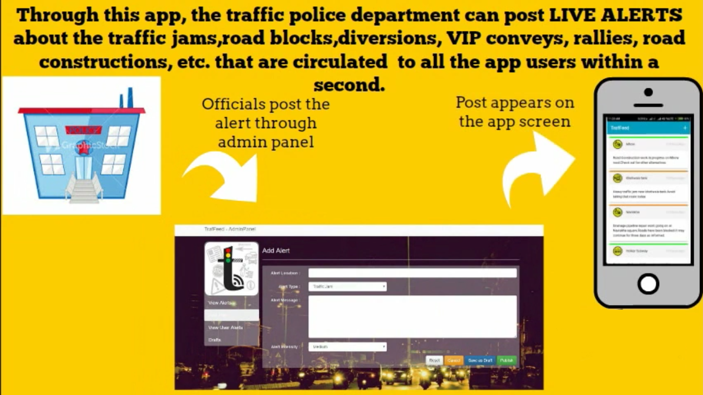
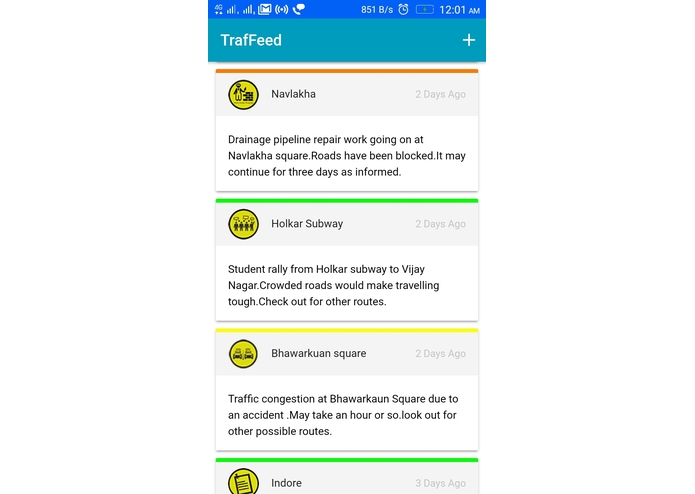

# Traffeed

Your personal traffic assistant helping you hop out the hurdles over the road guided by your own police department.

## Inspiration
Ever happened to you, that you urgently left for somewhere and reached even more late because of the road traffics, diversions, constructions, obstructions,etc ? This is exactly what inspired us to make TrafFeed. Because technically, its far better to know about the delay beforehand and save the time to be wasted by a bit than to reach by the end of the ceremony. And keeping in mind the safety of people driving on roads, the app also promotes awareness posts and notices.

## What it does

TrafFeed acts as a personal traffic assistant that lets you know beforehand, the updates or the news, regarding any cause that can delay you time before reaching your destination. It is done with the help of traffic coordinating officials who posts live alerts about the traffic jams, road blocks, diversions, VIP convey, rallies, construction alerts etc. through the handling website that are visible on the app screens of the people using the app.

Also, Users can extend their help by posting whatever updates they get in their surroundings which helps covering a larger area. To avoid fake updates and news, these updates are first checked by the concerned authorities through the [admin panel](https://mohitkh7.github.io/traffeed-website/#/login "Traffeed - Admin Panel" ), and only after proper verification are published on the app. The app gets a special responsibility of promoting the safety of citizens too and thus focuses on regular updates about the notices, new rules and awareness posts regarding the traffic systems.

## Screenshot 

## Video

## How I built it
This is a hybrid app which is built using Ionic 2 Framework and Cordova Phonegap. Its [Admin panel website](https://github.com/mohitkh7/traffeed-website/) is built using Angular JS and Bootstrap framework and hosted on Github pages. For the database of feeds we have used Google Firebase Database along with AngularFire.

